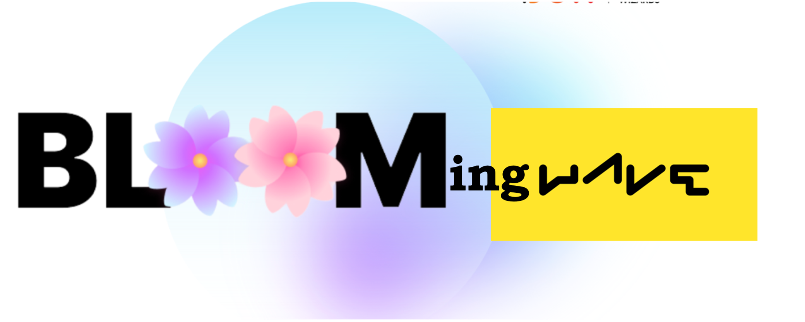
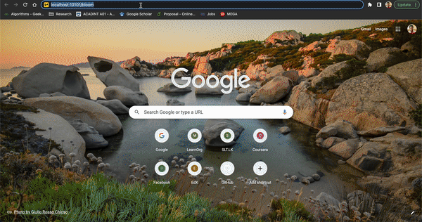

<div align="center">
  
  []()
  [](https://github.com/sakunaharinda/api-tester/issues)
  [](https://github.com/sakunaharinda/api-tester/pulls) 
  []()
  
</div>

<br />
<div align="center">
  <a href="https://github.com/sakunaharinda/BLOOMing-Wave">
    
  </a>
  <h2 align="center">BLOOMingWave</h2>
  <p align="center">
    <strong>Laveraging the power of Large Language Models</strong>
    <br/>
    <a href="https://github.com/sakunaharinda/BLOOMing-Wave/blob/main/README.md"><strong>Explore the docs »</strong></a>
    <br />
    <br />
    <a href="https://github.com/sakunaharinda/BLOOMing-Wave">View Demo</a>
    ·
    <a href="https://github.com/sakunaharinda/BLOOMing-Wave/issues">Report Bug</a>
    ·
    <a href="https://github.com/sakunaharinda/BLOOMing-Wave/issues">Request Feature</a>
  </p>
  <br/>
  <figure>
    
    <br/>
    <figcaption align = "center"><i><small>Demo</small></i></figcaption>
  </figure>
  
  
</div>
<br/>

## Table of Contents

- [Introduction](#intro)
- [System Requirements](#req)
- [Prerequisite](#prereq)
- [Quick Start](#qstart)
  - [H2O Wave Installation](#qstart_waveinstall)
  - [Setting Up the project](#qstart_setup)
  - [Run the application](#qstart_run)
- [Features](#features)
- [Acknowledgements](#ack)

## Introduction <a name = "intro"></a>

H2O Wave is a software stack for building beautiful, low-latency, real-time, browser-based applications and dashboards entirely in Python without using HTML, Javascript, or CSS. Using the framework, we can develop any kind of a business application or any data science related application. In this project, I created an application to use as a playground to use BLOOM models with a higher granularity than in huggingface to do several NLP tasks by prompt tuning. Enjoy !!! 

## System Requirements <a name = "req"></a>

- Python
- pip
- GIT

## Prerequisite <a name = "prereq"></a>

In order to use the application, you need to have a huggingface access token with read access. Follow the guide in [here](https://huggingface.co/docs/hub/security-tokens#:~:text=To%20create%20an%20access%20token,clicking%20on%20the%20Manage%20button.).

## Quick Start <a name = "qstart"></a>

### H2O Wave Installation <a name = "qstart_waveinstall"></a>

1. Download and extract the H2O Wave SDK for your platform using -
https://github.com/h2oai/wave/releases/tag/v0.19.0 
2. Move it to a location of interest. ($HOME/wave/)
3. Go to your Wave directory and open a new terminal. Start the wave server using,
  ```
./waved
```

Step-By-Step guide can also be found [here](https://wave.h2o.ai/docs/installation).

### Setting Up the project <a name = "qstart_setup"></a>

1. Clone the repository and go inside the folder.
  ```
  git clone https://github.com/sakunaharinda/BLOOMing-Wave.git
  cd BLOOMing-Wave
  ```
2. Set up the virtual environment
  ```
   python3 -m venv venv
   source venv/bin/activate
  ```
3. Install the dependancies
  ```
  pip install -r requirements.txt
  ```
  
### Run the application <a name = "qstart_run"></a>

1. Run the application using the following command
  ```
  wave run app.app
  ```
2. Then visit [localhost:10101](http://localhost:10101/bloom)
3. Enjoy playing with BLOOM !!


## Upcoming Features <a name = "features"></a>

New Chatbot, Sentiment Analysis, Summerization and many other features will be introduced soon !! 🤗

## Acknowledgements <a name = "ack"></a>

- H2O wave SDK - https://github.com/h2oai/wave 
- H2O Wave Documentation and Examples - https://wave.h2o.ai/docs/examples 


